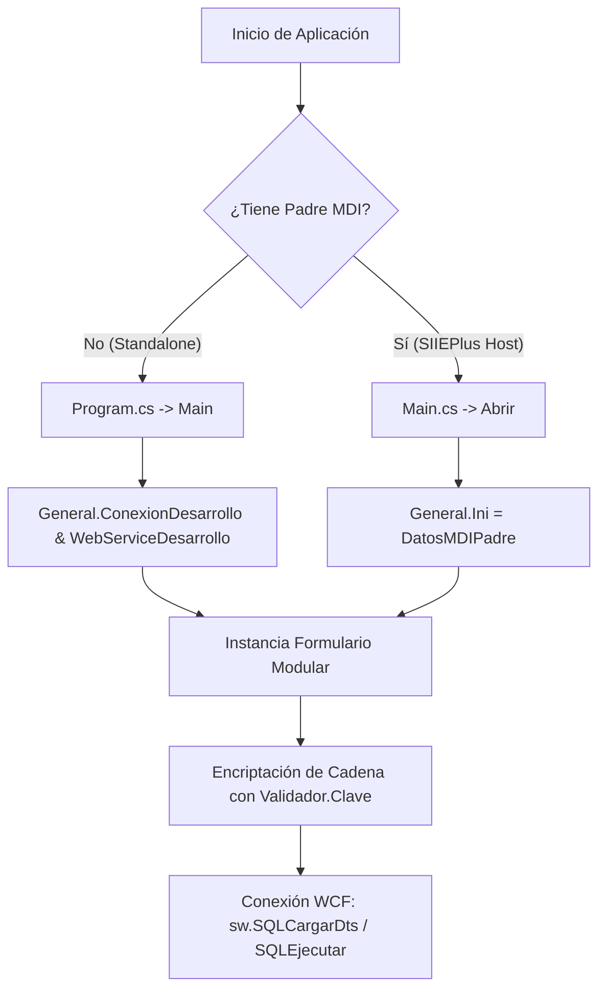

# Documentación y Análisis Técnico — AsignaturasModularizadas

**Fecha de actualización:** 29 de agosto de 2026 (10:45 AM)  
**Tipo de análisis:** Revisión estática periódica automatizada (Monitoreo cada 5 minutos).  
**Estado:** Documentación actualizada con los últimos cambios detectados en la lógica de persistencia y vinculación de planes de pago. No se modificó el código fuente.

---

## 1. Resumen Ejecutivo

`AsignaturasModularizadas` es un módulo cliente de escritorio desarrollado en **Windows Forms** sobre **.NET Framework 4.7.2**, diseñado para la gestión y consulta de asignaturas modulares, planes de pago asociados y matrículas de estudiantes dentro del ecosistema institucional **SIIEPlus**.

La aplicación interactúa mediante un servicio WCF (`ISQL` / `SQLClient`) para ejecutar consultas hacia el procedimiento almacenado `HOHorariosModular` y tablas financieras (`dbo.AFPlan`, `dbo.AFDetallePlan`, `dbo.AFTarifaAsignaturaModular`).

---

## 2. Inventario Técnico del Proyecto

| Componente | Especificación |
| :--- | :--- |
| **Solución** | `AsignaturasModularizadas.sln` |
| **Proyecto Principal** | `AsignaturasModularizadas/AsignaturasModularizadas.csproj` |
| **Tipo de Salida** | Windows Application (`WinExe`) |
| **Target Framework** | .NET Framework 4.7.2 |
| **Plataformas Soportadas** | Any CPU (`win`, `win-x86`, `win-x64`) |
| **Librería Gráfica (UI)** | Infragistics Ultimate WinForms v16.1 (`Infragistics4.Win.*`) |
| **Controles Institucionales** | `ControlesPlus.BarraSIIE`, `SIIEMessageBox` |
| **Dependencia NuGet** | `Newtonsoft.Json` (v13.0.3) |
| **Integración WCF** | `Connected Services/ServicioSQL` (`ISQL`, `SQLClient`, `SQLRespuesta`) |
| **Librerías SIIE Privadas** | `Buscador.dll`, `Conector.dll`, `ControlesPlus.dll`, `SIIEMessageBox.dll`, `Validador.dll` |
| **Ruta de Librerías Externas** | `C:\SIIE\Librerias\` |

---

## 3. Estructura del Código Fuente

```text
AsignaturasModularizadas/
├── AsignaturasModularizadas.sln
└── AsignaturasModularizadas/
    ├── App.config                               Configuración de bindings y endpoints WCF
    ├── AsignaturasModularizadas.csproj          Archivo de proyecto MSBuild (.NET 4.7.2)
    ├── Program.cs                               Punto de entrada standalone (Main)
    ├── Main.cs                                  Punto de entrada MDI para SIIEPlus
    ├── General.cs                               Variables globales y cadenas de desarrollo
    ├── FrmListadoModulares.cs                   Lógica de negocio, eventos y consumo WCF (Clase Modular)
    ├── FrmListadoModulares.Designer.cs          Definición visual de componentes, layouts y grids
    ├── FrmListadoModulares.resx                 Recursos del formulario
    ├── Connected Services/
    │   └── ServicioSQL/
    │       ├── Reference.cs                     Proxy cliente ISQL autogenerado
    │       ├── SQL.disco / SQL.wsdl / SQL*.xsd  Metadatos del contrato WCF
    │       └── Reference.svcmap                 Mapeo de servicio WCF
    └── Properties/
        ├── AssemblyInfo.cs                      Metadatos del ensamblado (v1.0.0.0)
        ├── Resources.Designer.cs / Resources.resx
        ├── Settings.Designer.cs / Settings.settings
        └── licenses.licx                        Licenciamiento de Infragistics
```

---

## 4. Registro de Cambios y Nuevas Implementaciones (Última iteración)

En la última revisión de código se identificaron los siguientes avances significativos en [`FrmListadoModulares.cs`](file:///c:/Users/CBNSoporteCDI7/source/repos/AsignaturasModularizadas/AsignaturasModularizadas/FrmListadoModulares.cs):

### 4.1. Implementación de Consulta y Cruce de Planes de Pago (`CargarPlanesAsignaturaSeleccionada`)
- Se implementó la consulta dinámica SQL que relaciona los planes generales (`dbo.AFPlan`) con las tarifas ya asignadas al módulo modular (`dbo.AFTarifaAsignaturaModular`):
  ```sql
  SELECT
      TAM.Id_TarifaAsignaturaModular,
      P.Id_Plan AS Id_Tarifa,
      P.NombrePlan,
      P.TipoPlan,
      P.ValorOrdinaria,
      P.ValorExtraordinaria,
      P.ValorDescuento,
      P.Id_Periodo,
      ISNULL(TAM.Activo, CAST(0 AS bit)) AS Activo,
      CASE
          WHEN TAM.Id_TarifaAsignaturaModular IS NULL THEN 'Disponible'
          WHEN ISNULL(TAM.Activo, 0) = 1 THEN 'Asociado'
          ELSE 'Inactivo'
      END AS Estado
  FROM dbo.AFPlan AS P
  LEFT JOIN dbo.AFTarifaAsignaturaModular AS TAM
      ON TAM.Id_Tarifa = P.Id_Plan
      AND TAM.Id_Modulo = {idAsignaturaPlanSeleccionada}
      AND TAM.Id_Periodo = {IdPeriodoModular}
  WHERE P.Id_Periodo = {IdPeriodoModular}
  ORDER BY P.NombrePlan
  ```
- **Control de Estado Visual:** El resultado se asigna a `ultraGridPlanesAsignatura`, mostrando claramente si el plan está en estado `Disponible`, `Asociado` o `Inactivo`.

### 4.2. Consulta de Cuotas y Desglose Financiero (`CargarDetallePlanSeleccionado`)
- Al hacer clic en un plan de pago en la grilla superior, se ejecuta la consulta hacia `dbo.AFDetallePlan`:
  ```sql
  SELECT
      Id_DetallePlan,
      Id_Plan AS Id_Tarifa,
      Concepto,
      Porcentaje,
      Valor,
      ValorExtr,
      FechaPago
  FROM dbo.AFDetallePlan
  WHERE Id_Plan = {idPlanSeleccionado}
  ORDER BY FechaPago, Id_DetallePlan
  ```
- El resultado alimenta directamente a `ultraGridDetallePlan`, reflejando porcentajes, fechas límites y recargos extraordinarios.

### 4.3. Persistencia de la Asociación Plan-Asignatura (`btnAsociarPlan_Click`)
- Se implementó la sentencia de guardado idempotente (`IF EXISTS ... UPDATE ... ELSE INSERT ...`) mediante `sw.SQLEjecutar`:
  - Registra `Id_Tarifa`, `Id_Modulo` (como `idAsignaturaPlanSeleccionada`), `Id_Periodo` (`IdPeriodoModular`), estado `Activo = 1` y el nombre del usuario de la sesión (`Environment.UserName`).
  - Al completar la asociación, refresca automáticamente la grilla de planes y notifica al usuario.
  - El botón `btnAsociarPlan` se bloquea automáticamente si el plan ya se encuentra en estado `Asociado`.

### 4.4. Estandarización del Período Académico
- Se sustituyó el número mágico `125` en las consultas de `ListadoProgramas()` y `AsignaturasModulares()` por la constante de clase `IdPeriodoModular`.

---

## 5. Arquitectura y Modos de Ejecución



1. **Modo Standalone (Desarrollo):** Ejecución directa con credenciales de desarrollo.
2. **Modo Integrado MDI (Producción):** Ejecución como formulario hijo en el shell `SIIEPlus`.

---

## 6. Mapeo de Operaciones WCF y Base de Datos

| Operación / Tabla | Destino | Parámetros Clave | Propósito |
| :--- | :--- | :--- | :--- |
| **`HOHorariosModular 'S'`** | SP | `Id_Periodo = IdPeriodoModular` | Listado general de programas con modulares. |
| **`HOHorariosModular 'S1'`** | SP | `IdProgOfre`, `IdPeriodoModular` | Asignaturas modulares de un programa. |
| **`HOHorariosModular 'S2'`** | SP | JSON `{"Id_Prog": id}` | Estudiantes matriculados en módulos por programa. |
| **`HOHorariosModular 'S3'`** | SP | JSON `{"Id_Matricula": id}` | Asignaturas inscritas por estudiante. |
| **`HOHorariosModular 'S4'`** | SP | Ninguno | Obtiene universo de matrículas modulares. |
| **`HOHorariosModular 'S5'`** | SP | JSON Array de matrículas | Cruce de programas activos para retroalimentación visual en verde. |
| **`dbo.AFPlan`** | Tabla / SQL Directo | `Id_Periodo`, `Id_Modulo` | Consulta de planes de pago aplicables a la asignatura modular. |
| **`dbo.AFDetallePlan`** | Tabla / SQL Directo | `Id_Plan` | Consulta de desglose de cuotas y fechas de vencimiento del plan. |
| **`dbo.AFTarifaAsignaturaModular`** | Tabla / SQLEjecutar | `Id_Tarifa`, `Id_Modulo`, `Id_Periodo`, `Usuario` | Inserción / actualización de la vinculación entre módulo y plan. |

---

## 7. Matriz de Hallazgos y Evaluación de Riesgos

| Categoría | Prioridad | Hallazgo | Ubicación | Impacto y Mitigación Recomendada |
| :--- | :--- | :--- | :--- | :--- |
| **Seguridad** | **Crítica** | Credenciales SQL Server en texto claro | `General.cs` (`ConexionDesarrollo`) | **Riesgo:** Exposición directa de credenciales en repositorios y binarios.<br>**Mitigación:** Externalizar a variables de entorno o almacén de secretos. |
| **Seguridad** | **Alta** | Comunicación WCF sin cifrado de transporte | `App.config`, `General.WebServiceDesarrollo` | **Riesgo:** Tráfico vulnerable a inspección y alteración en red local/WAN.<br>**Mitigación:** Habilitar HTTPS (`BasicHttpsBinding` con seguridad de transporte). |
| **Seguridad** | **Media** | Inyección SQL potencial en composición de cadenas | `FrmListadoModulares.cs` | **Riesgo:** Interpolación directa de variables en `strSql` (p. ej., `Environment.UserName` y variables de ID).<br>**Mitigación:** Utilizar parámetros SQL o encapsular la lógica en procedimientos almacenados dedicados. |
| **Rendimiento** | **Media** | Llamadas WCF sincrónicas en el hilo de UI | `sw.SQLCargarDts`, `sw.SQLEjecutar` | **Riesgo:** Bloqueo momentáneo de la ventana durante la ejecución de consultas.<br>**Mitigación:** Migrar a `SQLCargarDtsAsync` y `SQLEjecutarAsync` con `async/await`. |
| **Arquitectura** | **Baja** | Parametrización del período académico | `IdPeriodoModular = 125` | **Riesgo:** Período fijo que requerirá recompilación al iniciar un nuevo ciclo académico.<br>**Mitigación:** Cargar el período activo desde el contexto de inicio (`General.Ini`). |

---

## 8. Estado del Roadmap

- [x] Corrección del evento de selección en `ultraGridProgramas2_ClickCellButton`.
- [x] Estandarización de títulos y nombres descriptivos de controles.
- [x] Consulta y vinculación en interfaz de `dbo.AFPlan` y `dbo.AFDetallePlan`.
- [x] Implementación de lógica de asociación `AFTarifaAsignaturaModular` con auditoría de usuario.
- [ ] Parametrización dinámica de `Id_Periodo` desde `General.Ini`.
- [ ] Migración de consultas SQL inline a Procedimientos Almacenados en base de datos.
- [ ] Asincronía en llamadas WCF para evitar congelamiento de interfaz.
